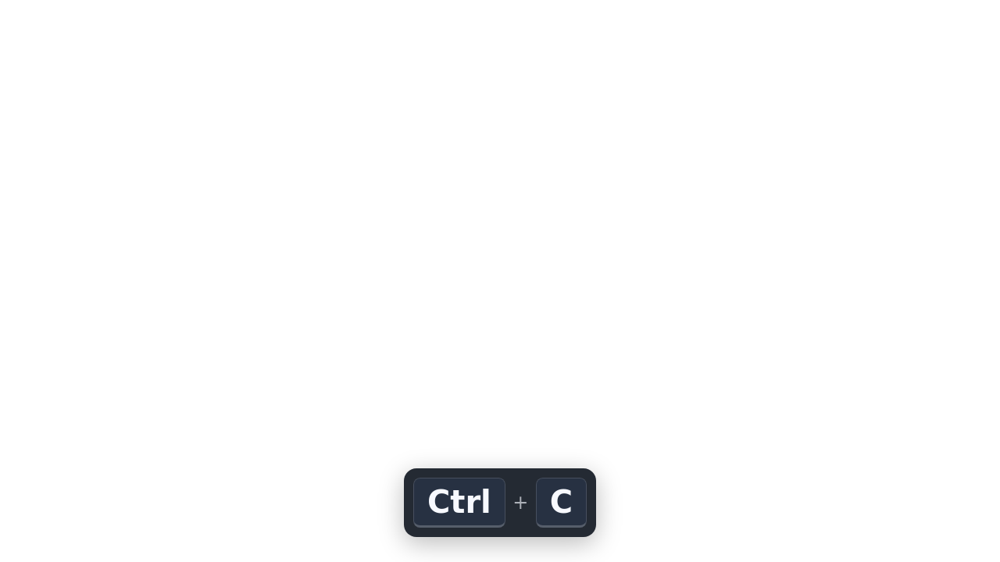

# Keycast Bridge

**English** · [Français](README.fr.md)

[](Cargo.toml)
[](Cargo.toml)
[](web/package.json)
[](docs/TESTING.md)
[](README.md#features)
[](README.md#obs-setup)
[](https://github.com/sjeje42/keycast-bridge/actions/workflows/ci.yml)
[](LICENSE)

**A local keyboard shortcut overlay for OBS on Linux / Wayland.**

[Documentation française](README.fr.md) · [Security model](SECURITY.md) · [Testing](docs/TESTING.md)

Version **0.1.0-alpha.2**. New implementation, not a Screenkey fork. GPL-3.0-only.
Rust capture and server, native GTK4 controls (English / French), Svelte + TypeScript browser overlay.
Primary target: Debian 13 + GNOME + OBS with Browser Source (official Flatpak). Other compositors are an architectural target, not a tested compatibility claim.



See the [exact validation status](docs/VALIDATION.md).

## Features

- Explicit start, administrator authorization for one selected keyboard, stop button and **Ctrl+Alt+F12** stop shortcut.
- Capture opens a single evdev device, drops root privileges, and forwards normalized labels over an anonymous pipe.
- AZERTY FR, QWERTY US / UK and QWERTZ DE using libxkbcommon. Select the same layout as your desktop.
- Default shortcuts mode: Ctrl / left Alt / Super combinations, function and navigation keys. Shift alone and AltGr text are excluded. Single-letter app shortcuts need the optional all-keys mode.
- Transparent OBS Browser Source, light/dark keycaps, adjustable size and lifetime, preview and copy-URL buttons.
- No key logs, analytics, remote resources, auto-start or background capture after closing the app.
- Read-only overlay URL with a fresh random token per launch, bound to `127.0.0.1:48732` only.

## Debian 13 package (amd64)

Download the `.deb` from [GitHub Releases](https://github.com/sjeje42/keycast-bridge/releases), then open a terminal in the download directory:

```sh
sudo apt install ./keycast-bridge_0.1.0~alpha.2-1_amd64.deb
```

Launch **Keycast Bridge** from the applications menu. No compilation required. APT installs dependencies; the package includes the capture helper and Polkit policy. Capture never starts automatically. Uninstall with `sudo apt remove keycast-bridge`.

Targets **Debian 13 on Intel/AMD 64-bit PCs**. Other Debian versions and Ubuntu are not validated. Uninstall any previous source installation with its uninstall script before installing the package. A manually installed helper alone in `/usr/local/libexec` can remain: the package uses `/usr/libexec`.

**OBS:** Debian’s OBS package has no Browser Source. Use the [official OBS Flatpak](https://obsproject.com/kb/linux-installation), which includes it. Keycast Bridge itself remains a Debian package.

## Build on Debian 13

Install build tools with your usual package manager:

```sh
sudo apt install build-essential pkg-config libgtk-4-dev libxkbcommon-dev libxkbcommon-tools xkb-data nodejs npm cargo rustc pkexec
```

Use a current stable Rust toolchain (the locked dependencies may require a newer version than the distribution provides). Node.js 22 is recommended. Build **as your ordinary user**, not root:

```sh
./scripts/build.sh
sudo ./scripts/install.sh
```

Launch **Keycast Bridge** from the GNOME applications menu. `sudo ./scripts/uninstall.sh` removes only the installed application files.

## OBS setup

1. Select your keyboard and layout in Keycast Bridge. The device list includes non-keyboards; the capture helper rejects them.
2. Copy the OBS URL. In OBS, add **Browser** as a source; use **1920 × 1080**, or your canvas size. Paste the URL. Keep the page background transparent.
3. Click **Test overlay** to display a synthetic shortcut; no keyboard access is needed. **Open preview** opens the same overlay in your browser.
4. Click **Start** and authorize the selected keyboard. Check that the status says **Capture active** before recording.
5. Click **Stop**, or press **Ctrl+Alt+F12** on the selected keyboard. The shortcut itself is not displayed.

The URL changes after every app launch. Update it in OBS. This deliberately avoids storing a long-lived token. OBS does not need administrator privileges.

**If Browser is absent from your OBS source list**, that OBS build has no Browser Source support. Install an OBS build/package providing that feature; this alpha does not implement an alternative window overlay.

## Development and demo

```sh
npm --prefix web ci
npm --prefix web run build
cargo test --locked --no-default-features
cargo run --locked --no-default-features --bin keycast-bridge-demo
```

The demo prints a local URL and sends synthetic shortcuts every three seconds. It does not open any input device. Only one app/demo can use port 48732 at a time.

The generated web assets are embedded into Rust binaries; build the web frontend before Cargo. Run `npm --prefix web run check` and `cargo fmt --check` before committing. CI builds the GTK app, checks formatting and linting, and runs unit and HTTP/WebSocket integration tests. The badge above links to the current workflow status.

## Current limits

- No automatic password-field detection: stop capture before entering secrets, even in shortcuts-only mode.
- One selected keyboard; unplugging ends capture. Refresh and restart after reconnecting.
- Layout changes in GNOME are not automatically tracked; stop, choose the new layout, then restart.
- No text reconstruction, Compose/dead-key composition, IME, mouse visualization, persistent preferences yet.
- Key-repeat events are intentionally ignored. Modifiers held before Start must be released and pressed again. Caps Lock / Num Lock state already active at startup is not synchronized with GNOME.
- System-wide evdev access does not identify focused windows, lock screens or active sessions. Stop before locking the session; lock-screen auto-pause is not implemented.
- This alpha needs real-device acceptance tests before it should be used for live broadcasts.

## License and acknowledgments

Copyright © 2026 Jérôme Stavrianos. Licensed under **GPL-3.0-only**, see [LICENSE](LICENSE). No Screenkey source code or assets are included. Screenkey inspired the use case. Dependencies retain their own licenses.
